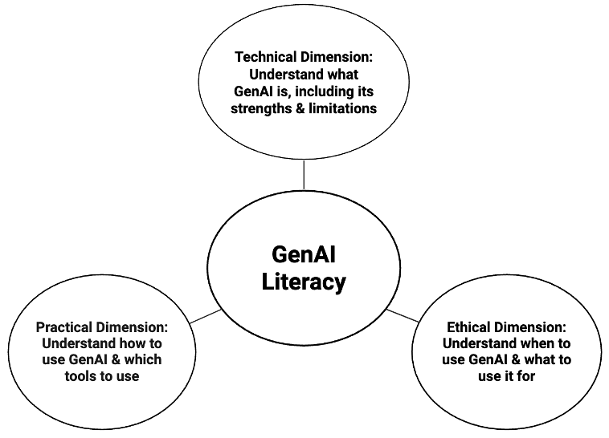

# Code of Conduct

For nurse scientists operating at the intersection of clinical care and research, using GenAI thoughtfully begins with GenAI literacy—an increasingly essential professional competency. GenAI literacy is defined here as having the knowledge and skills to use GenAI tools effectively, responsibly, and ethically to accomplish tasks. We conceptualize GenAI literacy across three core dimensions: technical, practical, and ethical (Figure 2).

{width=70%}

Before beginning, we review an example analytic code of conduct for responsible GenAI collaboration, built around those three dimensions of GenAI literacy (Table 1). These examples are offered not as prescriptive rules but as illustrative examples; individuals are encouraged to adapt them to their own values, research context, and institutional policies.

**Table 1.** Example analytic code of conduct for GenAI use.

| Principle | Description |
|---|---|
| Build competence before reliance | Prioritize understanding statistical and programming concepts before using GenAI-generated code |
| Respect data privacy | Do not upload real participant data (use synthetic data during code development) |
| Maintain objectivity | Critically evaluate GenAI output (check for hallucinations and misapplied methods) |
| Retain interpretive authority | GenAI can translate statistical output into plain language, but humans determine clinical and scientific significance |
| Be transparent | Disclose GenAI involvement in code, figures, and manuscripts |
| Revisit ethics and policy | Frequently revisit GenAI ethics through regular self-reflection as norms evolve rapidly |

::: {.callout-important}
GenAI is a tool, not a decision-maker.Humans retain full interpretive authority over every analytic decision in this workflow.
:::