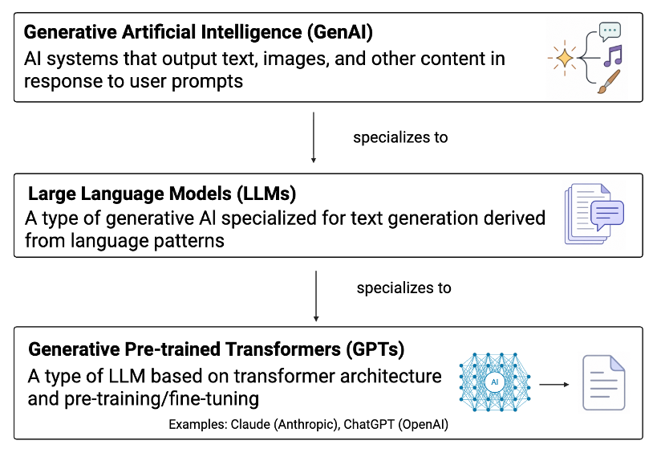

# Overview

## Copyright

Copyright 2026, University of Pittsburgh. All Rights Reserved. 
License: GPL-2 ([link](https://www.gnu.org/licenses/old-licenses/gpl-2.0.en.html))

## Introduction

Generative AI (GenAI) tools (e.g., Claude, Gemini) are systems capable
of generating text, code, and other content in response to user
prompts (Figure 1).

{width=70%}
